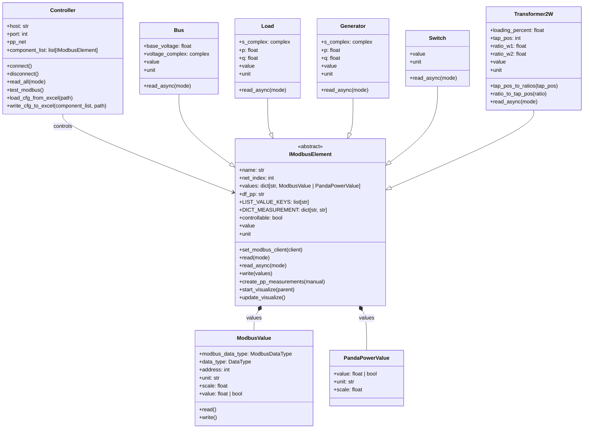
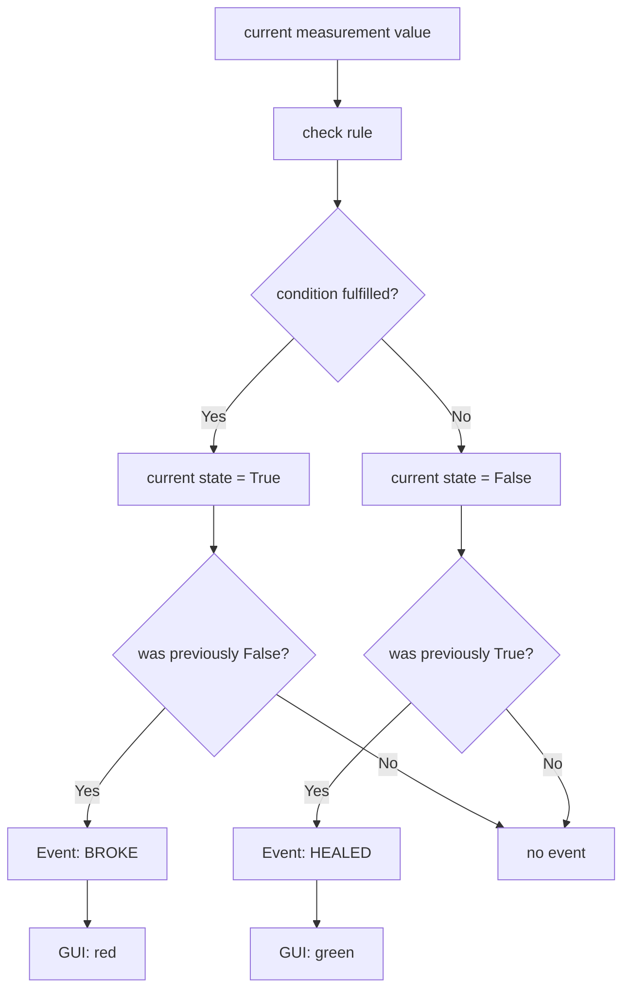
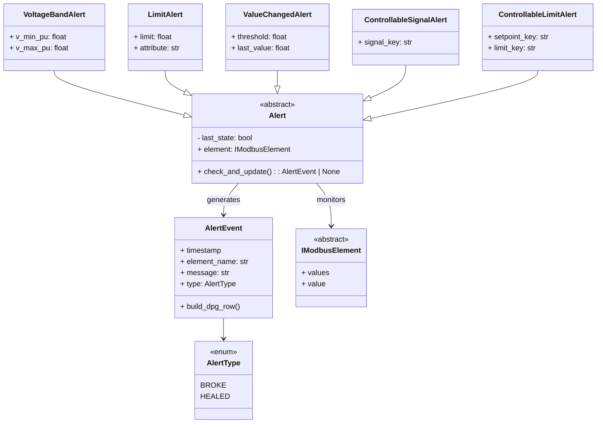

# CiL (Controller-in-the-Loop) - Project Documentation

[](https://www.python.org/)
[](https://www.pandapower.org/)

## 1. Project Context

**Working title:**

Design and commissioning of a C-HiL test bench for optimization workflows in electrical distribution grids based on an OPAL-RT 4510 platform.

This document places the technical implementation of package `CiL` in the context of the overall project work. The focus is on practical system setup, commissioning, and demonstrable operation of a controller-hardware-in-the-loop test bench.

## 2. Goals and Current Focus

The objective of the project work corresponds to the working title: the development and commissioning of a C-HiL test bench based on opalRT. Within the scope of the implementation, particular emphasis is placed on a structured and sustainable software and system design. The implementation is based in particular on the following fundamental aspects:

- **Modularization**: The test bench is to be divided into logically separated, clearly defined, and as far as possible reusable modules. This allows individual components to be developed, tested, adapted independently of one another and, if necessary, reused in other application scenarios.
- **Extensibility**: Through a sufficiently abstract design, it should be ensured that the test bench can be extended with minimal effort to include additional functions, components, or interfaces. This creates the foundation for long-term use and adaptation to future requirements.
- **Robustness**: The implementation is to be designed for stable and fault-tolerant operation. This includes suitable mechanisms for error handling, safeguarding of critical functions, and a traceable handling of unexpected states or erroneous inputs.
- **Readability/Efficiency**: The codebase should be designed to be both easily readable and efficient. This is achieved in particular through appropriate encapsulation, clear levels of abstraction, and a structured architecture. The goal is to increase maintainability and comprehensibility without neglecting system performance.

The currently prioritized interfaces are:

- **CiL (optimization) -> OPAL-RT/ePHASORSIM**
- **OPAL-RT/ePHASORSIM -> Dashboard visualization**

The fundamental test bench setup is predefined in the project context as a reference; this documentation focuses in content on the two interfaces mentioned above as well as their software-technical implementation within the `CiL` package.
 
## 3. System Context and Architecture

The package `CiL` implements a Controller-Hardware-in-the-Loop (C-HiL) runtime environment for coupling a static grid model (``pandapower``) with a real-time simulator (``OPAL-RT/ePHASORSIM``) via Modbus-TCP. The goal is a consistent, near-real-time interaction between simulation, control, and evaluation.

The runtime system is structured into four logically separated layers:

1. **Communication layer** (`Value.py`, `Controller.py`)
- Encoding/decoding of Modbus registers (DIGITAL, INT16, UINT16, INT32, UINT32, FLOAT32)
- Management of a persistent TCP connection
- As well as control of the event loop for cyclic data processing
2. **Grid-element domain layer** (`IModbusElement.py` + concrete classes)
- In this layer, the domain-specific semantics of the individual grid elements are represented (`Bus`, `Load`, `Generator`, `Switch`, `Transformer2W`)
- Each element encapsulates its specific behavior and provides a uniform interface
3. **Estimation and data consolidation layer** (`dashboard/Dashboard.py`)
- Measurement setup, state estimation (Weighted Least Squares (WLS) algorithm), writing results back into master data
4. **Visualization and alerting layer** (`dashboard/*.py`, `map/*.py`)
- Dashboard, map overlay, event log, and alert edge detection

The control and monitoring of grid elements are handled centrally via an abstracted layer based on ``IModbusElement.py``. All grid elements follow a uniform structural design: they manage their states in the form of a dictionary of values.

These values are represented by the classes ``ModbusValue`` or ``PandaPowerValue``. This makes it possible for a grid element to flexibly obtain its data from different sources, for example:

directly from the real-time simulation (Modbus-TCP),
from state estimation,
or from higher-level optimization algorithms.

Class-specific characteristics are encapsulated within the respective subclasses. For example, in transformers the tap changer position is represented via the winding ratio between the high- and low-voltage side, whereas in ``pandapower`` the same quantity is modeled as a tap changer position. This mapping is performed transparently within the respective implementation.

The entire communication logic is fully encapsulated in ``Value.py`` and ``IModbusElement.py``. As a result, no additional implementation effort is required from the user with regard to communication integration, which significantly simplifies the use and extension of the system.

## 4. Class-Diagram


## 5. Package Structure

```bash
CiL/
|- Controller.py          # Orchestration: Modbus <-> components <-> network
|- IModbusElement.py      # Abstract base class and default I/O behavior
|- Value.py               # ModbusValue / PandaPowerValue
|- Enum.py                # ReadMode, ModbusDataType, DataType
|- Bus.py
|- Load.py
|- Generator.py
|- Switch.py
|- Transformer2W.py
|- dashboard/             # Dashboard, alerts, events, map overlay
|- map/                   # Map widget and tile management
|- configuration/         # Configuration tools
\- pyproject.toml
```

## 6. Communication and Data Model

### 6.1 Modbus object types

- `coil` (RW, 1 bit)
- `discrete_input` (RO, 1 bit)
- `input_register` (RO, 16 bit)
- `holding_register` (RW, 16 bit)

Numeric types:

- `uint16`, `int16`
- `uint32`, `int32`, `float32`

**Note:** The implementation assumes OPAL-RT byte ordering `BACD`.

### 6.2 `IModbusElement` invariants

- Required keys (`LIST_VALUE_KEYS`) are auto-filled as `PandaPowerValue` placeholders when missing.
- Modbus reads are executed per element in parallel (`asyncio.gather`).
- Writes are routed by type either to Modbus or directly into `pandapower` dataframes.
- Standardized time-series visualization is available for all elements.

## 7. Component-Level Summary

| Class | Model semantics | Key specifics |
|---|---|---|
| `Bus` | Bus voltage | p.u./kV conversion and complex voltage representation |
| `Load` | Consumer power | Direct mapping of `p_mw`, `q_mvar` |
| `Generator` | Generation | Sign correction for Modbus-origin values |
| `Switch` | Switching state | Boolean state without physical unit |
| `Transformer2W` | Transformer load/tap | Conversion `tap_pos` <-> off-nominal ratios |

## 8. Dashboard Subsystem (`dashboard`)

- `Dashboard.py`: Runtime GUI class for cyclic acquisition, state estimation, alert checks, and KPI updates
- `Alert.py`: Rule-based event detection framework with edge detection (`BROKE`/`HEALED`)
- `AlertEvent.py`: Event data model and GUI rendering helper
- `MapOverlay.py`: Topology-aware map visualization and hover refresh

### 8.1 `dashboard/Dashboard.py`

**Role:** Central runtime class for GUI construction, cyclic data acquisition, state estimation, alert evaluation, and KPI display.

**Key characteristics:**

- topology validation before startup (`pp_net`, `bus.geo` required)
- connection strategy with retry attempts (`try_connect`, `sleep`)
- separate execution of GUI render loop and update loop (background thread)
- runtime metrics:
  - Modbus query time (`query_ms`)
  - state estimation total and core time (`se_full_ms`, `se_ms`)
  - GUI update time (`gui_ms`)

**Data flow in the update loop:**

1. `read_all(ReadMode.MODBUS)`
2. measurement construction (`_build_se_measurements`)
3. state estimation (`pp.estimation.estimate`, WLS algorithm)
4. reading back pandapower results (`read_all(ReadMode.PANDAPOWER)`)
5. alert evaluation (`_evaluate_alerts`)
6. visualization update (aggregates, time series, map hover texts)

```mermaid
sequenceDiagram
    autonumber
    participant GUI as Dashboard / GUI
    participant CTRL as Controller
    participant ELEM as IModbusElement / Subclass
    participant MB as ModbusValue
    participant RT as OPAL-RT / ePHASORSIM
    participant PP as pandapower

    par Read all Modbus-TCP Values
        GUI->>CTRL: read_all(ReadMode.MODBUS)
        CTRL->>ELEM: read_async(mode) for all grid elements
        parallel read for grid elements
            ELEM->>MB: await read()
            MB->>RT: Modbus-Function Code 1/2/3/4
            RT-->>MB: Register / Coil / Input
            MB-->>ELEM: decoded and scaled Value
        end
        ELEM-->>CTRL: current Measurements
        CTRL-->>GUI: all Measurements
    end

    par Create Measurements in pandapower-grid
        GUI-->>ELEM:create_pp_measurements(True)
        Note over ELEM: create_pp_measurements(True) -> Returns DataFrame-Rows for performance-Boost 
        Note over ELEM: create_pp_measurements(False) -> pp.create_measurement() with all internal checks
        ELEM-->>GUI: grid model with Measurements from ePHASORSIM
    end 

    GUI-->>GUI: pandapower-StateEstimation

    par read current grid modell state
        GUI->>CTRL: read_all(ReadMode.PANDAPOWER)
        CTRL->>ELEM: read from state estimation
        ELEM->>PP: read current values
        PP-->>ELEM: refreshed values
        ELEM-->>GUI: Current grid state for Visualization / KPI / Alarms
    end

    GUI-->>GUI: Check all Alerts in in self._alert_list
```

**Visual Analytics:**

- aggregated power/energy curves (load, generation, balance)
- automatic axis scaling within the time window
- cycle-time-dependent color classification (`QT_GOOD_MS`, `QT_WARN_MS`)

### 8.2 `dashboard/Alert.py`

**Role:** Abstract and concrete rule set for event detection.

**Core Logic:**

- `Alert.check_and_update()` implements edge detection:
  - `False -> True`  => `AlertType.BROKE`
  - `True -> False`  => `AlertType.HEALED`



**Alert classes and use cases:**

- `VoltageBandAlert`: under-/overvoltage in `p.u.`
- `LimitAlert`: threshold violation of an attribute
- `ValueChangedAlert`: change detection with threshold `threshold`
- `ControllableSignalAlert`: discrete/analog signal changes
- `ControllableLimitAlert`: comparison of setpoint signal against profile limit

This establishes a formally clear transition from continuous measurements to discrete events.



### 8.3 `dashboard/AlertEvent.py`

**Role:** Event data record and GUI rendering adapter.

**Structure:**

- timestamp, source class, element name, message text, type (`BROKE`/`HEALED`)
- relative or absolute time formatting
- direct creation of a DPG row (`build_dpg_row`) with color coding:
  - red for `BROKE`
  - green for `HEALED`

### 8.4 `dashboard/MapOverlay.py`

**Role:** Map-based topological visualization on DPG overlay layers.

**Core functional elements:**

- initial overlay construction (``bus``, ``line``, ``ext_grid``)
- periodic overlay and hover refresh via frame callback
- zoom-to-fit for entire network (`zoom_to_network`)
- distance-based object identification (``bus`` prioritized over ``line``)

**Color mapping:**

- bus color from `res_bus.vm_pu` in interval `[0.9, 1.1]`
- line color from `res_line.loading_percent` in interval `[0, 100]`
- open switches: gray line representation (`COL_OPEN`)
- error case (missing results): `COL_ERROR`

Color calculation uses linear interpolation along a defined colormap (`CMAP`).

## 9. Excel Configuration Format

The CiL configuration is split into two worksheets:

- `Components`: element class, name, network index
- `ModbusValues`: attribute, ModbusDataType, DataType, address, unit, scaling

Main APIs:

- `Controller.load_cfg_from_excel(path)`
- `Controller.write_cfg_to_excel(component_list, path)`
- `Controller.get_class_map()`

## 10. Installation

```bash
# from repository root
pip install -r requirements.txt

# optional editable install for active development
cd CiL
pip install -e .
```

## 11. Quick Start

### 11.1 Controller runtime

```python
import pandapower as pp
from CiL.Controller import Controller
from CiL.Enum import ReadMode

net = pp.from_pickle("MV_Oberrhein_2026.p", True)
elements = Controller.load_cfg_from_excel("CiL-configuration.xlsx")

ctrl = Controller(_host="localhost", _port=502, _pp_net=net, _component_list=elements)

if ctrl.test_modbus():
    ctrl.connect()
    ctrl.read_all(ReadMode.ALL)
    ctrl.disconnect()
```

### 11.2 Dashboard runtime

```python
import pandapower as pp
from CiL.Bus import Bus
from CiL.Controller import Controller
from CiL.dashboard.Alert import VoltageBandAlert
from CiL.dashboard.Dashboard import Dashboard

net = pp.from_pickle("MV_Oberrhein_2026.p", True)
elements = Controller.load_cfg_from_excel("CiL-configuration.xlsx")

alerts = []
for element in elements:
    if element.df_pp == "bus":
        alerts.append(VoltageBandAlert(element, v_min_pu=0.97, v_max_pu=1.03))

ctrl = Controller("localhost", 502, net, elements)
dashboard = Dashboard(ctrl, alerts, _vis_element_ignore=[Bus])
dashboard.start()
```

An end-to-end example is available in `../examples/TestSim.py`.

## 12. Related Documentation

- [NetConverter documentation](configuration/NetConverter/README.md)

## 13. Detailed Description of All Main Scripts (CiL Root)

### 13.1 `__init__.py`

This file defines the package at the top level and serves as the import entry point for runtime, component, and dashboard modules. Domain logic is intentionally not included here.

### 13.2 `Enum.py`

`Enum.py` provides the type-safe foundation for communication configuration.

- `ReadMode`: Control of the read source (`MODBUS`, `PANDAPOWER`, `ALL`)
- `ModbusDataType`: Memory area semantics (bit/register, read-only/read-write)
- `DataType`: Register width and label for numerical data types

Scientifically relevant is the strict separation of transport type (`ModbusDataType`) and numerical interpretation (`DataType`), which ensures that the register logic remains formally consistent.

### 13.3 `Value.py`

`Value.py` implements the atomic data layer.

- `PandaPowerValue`: passive data container for grid model values (e.g. `sgen` → `p_mw`)
- `ModbusValue`: active register entity with read/write methods

Core methods:

- `read()`: selection of the correct Modbus function code, response validation, decoding, and scaling
- `write()`: inverse scaling, register encoding, and register/coil-specific writing
- `__decode()` / `__encode()`: mapping between raw registers and mathematical values

The module thus encapsulates the entire signal transformation between physical quantities and Modbus raw representation.

### 13.4 `IModbusElement.py`

This script is the abstract base class for all grid elements and defines the operational framework conditions for the grid elements (e.g. `sgen`, `load`, etc.):

- mandatory value management (`LIST_VALUE_KEYS`)
- asynchronous reading from mixed sources
- selective writing to Modbus or pandapower
- standard visualization and measurement generation

Core methods:

- `read_async(mode)`: parallel Modbus reading plus synchronous DataFrame reading
- `write(values)`: type-dependent writing to target systems
- `create_pp_measurements(manual)`: measurement mapping for state estimation
- `start_visualize()` / `update_visualize()`: time-window-based real-time visualization

Methodologically, `IModbusElement` is the central integration layer between communication and grid model semantics.

### 13.5 `Controller.py`

`Controller.py` implements system orchestration.

Main responsibilities:

- establishment and management of a persistent Modbus-TCP connection
- distribution of the client to all grid elements
- cyclic parallel reading of all elements
- import/export of configuration via Excel
- dynamic class resolution (`get_class_map`) for extensible component models

Core APIs:

- `connect()` / `disconnect()`
- `test_modbus()`
- `read_all(mode)`
- `load_cfg_from_excel(path)`
- `write_cfg_to_excel(component_list, path)`

The file thus forms the control core of the entire runtime system.

### 13.6 `Bus.py`

`Bus.py` models node voltage states including complex voltage representation.

Domain logic:

- mandatory attributes: `vm_pu`, `va_degree`
- automatic base voltage determination from `vn_kv`
- heuristic distinction between voltage input in volts and p.u. input
- calculation of the complex voltage and optional p.u. display

The class combines measurement interpretation, unit transformation, and complex grid quantities in a consistent manner.

### 13.7 `Load.py`

`Load.py` models load objects based on complex power.

Key points:

- mandatory attributes: `p_mw`, `q_mvar`
- formation of $S = P + jQ$ and display of $|S|$ in kVA
- direct linkage to `load` tables in pandapower

The class is intentionally kept minimal and serves as a reference for a linear, robust load representation.

### 13.8 `Generator.py`

`Generator.py` extends the load logic with generator semantics.

Specific aspects:

- mandatory attributes: `p_mw`, `q_mvar`
- sign correction for Modbus values (consumer reference arrow system → generator counting arrow system)
- optional second time series for profile setpoints (`profile_p_mw`, `profile_q_mvar`)

This makes the class particularly suitable for comparing actual operation and profile operation.

### 13.9 `Switch.py`

`Switch.py` represents discrete switching states.

Properties:

- mandatory attribute: `closed`
- boolean primary value without physical unit
- simple, robust integration into Modbus and pandapower workflows

The class is the discrete counterpart to continuous power and voltage objects.

### 13.10 `Transformer2W.py`

`Transformer2W.py` addresses transformer-specific tap changer logic.

Core domain elements:

- mandatory attributes: `loading_percent`, `tap_pos`
- parameter retrieval (`tap_step_percent`, `tap_neutral`, `tap_side`)
- transformation between discrete tap position and off-nominal ratio (`tap_pos_to_ratios`, `ratio_to_tap_pos`)
- automatic population of optional control values (`set_rW1`, `set_rW2`)

The file thus represents the central interface between discrete control settings and continuous equivalent parameterization.