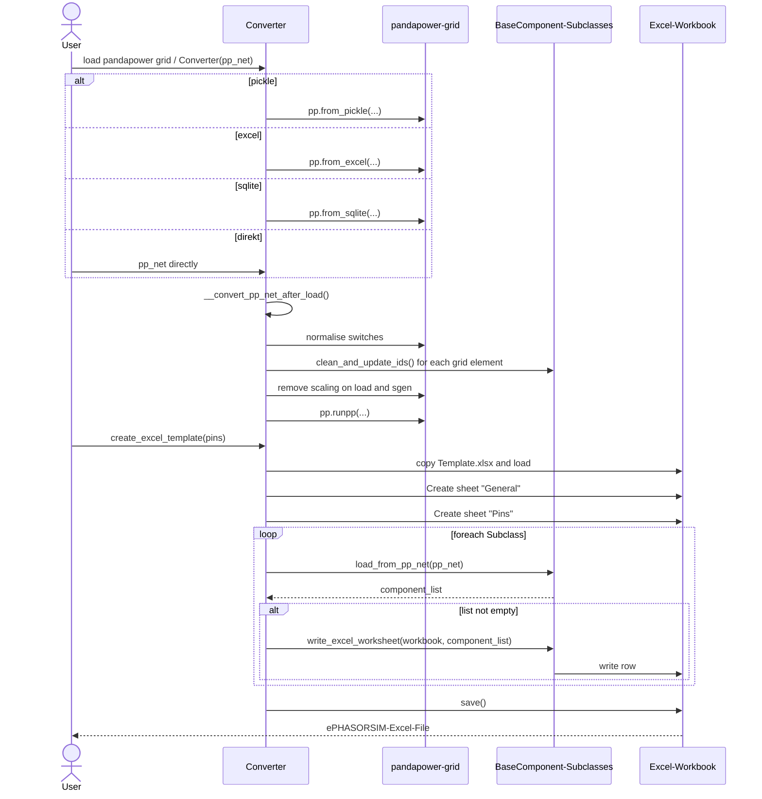

# PPtoePHASORSIM - pandapower to ePHASORSIM Converter

[](https://www.python.org/)
[](https://www.pandapower.org/)

## Overview

The converter transforms `pandapower` grid models into the Excel format required by an **ePHASORSIM** solver block (template version `v2.0`).

It extracts buses, lines, loads, transformers, switches, shunts, and voltage sources from a `pandapower` network, runs a power flow for initial values, and writes a structured Excel file that can be loaded directly in ePHASORSIM.

An optional pin configuration defines I/O signals for integration with external systems (for example a Simulink control loop or a Modbus slave used for dashboard visualization).

New component types can be added without changing the converter core, as long as no special transformation is required.

## Supported Components

| Class | ePHASORSIM model | Notes |
|---|---|---|
| `Bus` | Bus | SLACK/PQ, initial values from load flow |
| `Line` | Positive-Sequence Line | Pi equivalent, per-unit conversion |
| `Load` | Positive-Sequence Constant Power Load | Static generators mapped as negative load |
| `Transformer` | Positive-Sequence 2W-Transformer | Short-circuit impedance, tap, magnetization |
| `Switch` | Switch (bus-bus) | Auto-normalized from line/transformer switches |
| `VoltageSource` | Positive-Sequence Voltage Source | One source per SLACK bus |
| `Shunt` | Positive-Sequence Shunt | Active and reactive power |

## Class-Diagram

```mermaid
classDiagram
    class BaseComponent {
        <<abstract>>
        +model_typ: str | None
        +worksheet_name: str | None
        +instruction_list: list[str]
        +prefix_dict: dict[str, str]
        +id: str | int
        +__init__(_id)
        +to_row() List[Any]*
        +load_from_pp_net(_pp_net) List[object]*
        +clean_and_update_ids(_pp_net) pandapowerNet
        +write_excel_worksheet(excel_workbook, component_list)
        +clean_id(_id, _prefix) str
    }

    class Bus {
        +worksheet_name: str | None = "Bus"
        +instruction_list: list[str]
        +base_voltage
        +vmag
        +unit
        +angle
        +type
        +__init__(_id, _base_voltage, _vmag, _unit, _angle, _type)
        +to_row() List[Any]
        +load_from_pp_net(_pp_net) List[object]
    }

    class Line {
        +model_typ: str | None = "Positive-Sequence Line"
        +worksheet_name: str | None = "Line"
        +instruction_list: list[str]
        +prefix_dict: dict[str, str]
        +status
        +from_bus
        +to_bus
        +resistance
        +reactance
        +capacitive
        +__init__(_id, _status, _from_bus, _to_bus, _resistance, _reactance, _capacitive)
        +to_row() List[Any]
        +load_from_pp_net(_pp_net) List[object]
    }

    class Load {
        +model_typ: str | None = "Positive-Sequence Constant Power Load"
        +worksheet_name: str | None = "Load"
        +instruction_list: list[str]
        +prefix_dict: dict[str, str]
        +status
        +bus
        +active_power
        +reactive_power
        +__init__(_id, _status, _bus, _active_power, _reactive_power)
        +to_row() List[Any]
        +load_from_pp_net(_pp_net) List[object]
    }

    class Shunt {
        +model_typ: str | None = "Positive-Sequence Shunt"
        +worksheet_name: str | None = "Shunt"
        +instruction_list: list[str]
        +prefix_dict: dict[str, str]
        +status
        +bus
        +active_power
        +reactive_power
        +__init__(_id, _status, _bus, _active_power, _reactive_power)
        +to_row() List[Any]
        +load_from_pp_net(_pp_net) List[object]
    }

    class Switch {
        +worksheet_name: str | None = "Switch"
        +instruction_list: list[str]
        +prefix_dict: dict[str, str]
        +status
        +from_bus
        +to_bus
        +__init__(_id, _status, _from_bus, _to_bus)
        +to_row() List[Any]
        +load_from_pp_net(_pp_net) List[object]
    }

    class Transformer {
        +model_typ: str | None = "Positive-Sequence 2W-Transformer"
        +worksheet_name: str | None = "Transformer"
        +instruction_list: list[str]
        +prefix_dict: dict[str, str]
        +status
        +from_bus
        +to_bus
        +resistance
        +reactance
        +gmag
        +bmag
        +ratio_w1
        +ratio_w2
        +phase_shift
        +__init__(_id, _status, _from_bus, _to_bus, _resistance, _reactance, _gmag, _bmag, _ratio_w1, _ratio_w2, _phase_shift)
        +to_row() List[Any]
        +load_from_pp_net(_pp_net) List[object]
        +_get_short_circuit_impedance_pu(_trafo, _base_sn)$
        +_get_ratios(_trafo)$
        +_get_magnetizing_admittance(_trafo, _base_sn)$
    }

    class VoltageSource {
        +model_typ: str | None = "Positive-Sequence Voltage Source "
        +worksheet_name: str | None = "Voltage Source"
        +instruction_list: list[str]
        +bus
        +voltage
        +angle
        +rs
        +xs
        +__init__(_id, _bus, _voltage, _angle, _rs, _xs)
        +to_row() List[Any]
        +load_from_pp_net(_pp_net) List[object]
    }

    BaseComponent <|-- Bus
    BaseComponent <|-- Line
    BaseComponent <|-- Load
    BaseComponent <|-- Shunt
    BaseComponent <|-- Switch
    BaseComponent <|-- Transformer
    BaseComponent <|-- VoltageSource
```



## Anwendungsstruktur



## Project Layout

```bash
NetConverter/
|- PPtoePHASORSIM.py    # Main converter and Pin data class
|- Base.py              # Abstract base class BaseComponent
|- Bus.py
|- Line.py
|- Load.py
|- Transformer2W.py
|- Shunt.py
|- Switch.py
|- VoltageSource.py
|- Template.xlsx        # OPAL-RT Excel template v2.0 - do not modify
\- README.md
```

## Installation

```bash
pip install -e .
# or with uv:
uv sync
```

Dependencies (see `pyproject.toml`): `pandapower >= 3.3`, `numpy`, `openpyxl`, `pandas`.

## Quick Start

### Basic conversion

```python
import pandapower as pp
from PPtoePHASORSIM import Converter

converter = Converter()
converter.load_pp_net_from_pickle("network.p")
converter.create_excel_template("IEEE30_OPALRT.xlsx")

# Optional: save sanitized pandapower network
pp.to_pickle(converter.pp_net, "network_sanitized.p")
```

### Pin configuration

```python
from PPtoePHASORSIM import Converter, Pin

pins = [
    Pin(pin_type=Pin.Type.OUTGOING, label="Vmag", component_list=["0", "1"]),
    Pin(pin_type=Pin.Type.INCOMING, label="trip", component_list=["SW1"]),
]

converter = Converter()
converter.load_pp_net_from_pickle("network.p")
converter.create_excel_template("network_with_pins.xlsx", _list_pins=pins)
```

### Supported input formats

```python
converter.load_pp_net_from_pickle("network.p")
converter.load_pp_net_from_excel("network.xlsx")
converter.load_pp_net_from_sqlite("network.db")
```

## Conversion Pipeline

After loading a `pandapower` network, the converter executes these steps:

1. **Switch normalization**: line/transformer switches are transformed into bus-bus switches by inserting helper buses (required by ePHASORSIM).
2. **ID sanitization**: spaces and special characters are removed; integer names receive class-specific prefixes (for example `Ln3`); duplicates are disambiguated.
3. **Scaling resolution**: `scaling` factors in `load` and `sgen` are applied to absolute P/Q/S values and reset to 1 because ePHASORSIM has no scaling column.
4. **Load flow**: `pp.runpp()` validates consistency and computes initial values for export.

## Pin Configuration

Pins define the signal interface between ePHASORSIM and an external real-time system. Each pin has a `label`, a direction, and a list of target component IDs.

| `Pin.Type` | Direction |
|---|---|
| `INCOMING` | Signal is written into the model |
| `OUTGOING` | Signal is read from the model |

Available signals per component type (`instruction_list`):

| Class | Available signals |
|---|---|
| `Bus` | `Vmag`, `Vang`, `trip`, `VangU` |
| `Line` | `faulty`, `fault_distance_factor`, `status`, `Imag0/1`, `Iang0/1`, `P0/1`, `Q0/1`, `PL`, `QL`, `resistance`, `reactance`, `capacitance` |
| `Load` | `status`, `P`, `Q`, `Imag`, `Iang` |
| `Transformer` | `rW1`, `rW2`, `Imag1/2`, `Iang1/2` |
| `Switch` | `status`, `Imag`, `Iang` |
| `VoltageSource` | `Vmag`, `Vang`, `resistance`, `reactance`, `Imag`, `Iang`, `Pout`, `Qout` |
| `Shunt` | `Imag`, `Iang`, `P`, `Q`, `status` |

## Extending the Converter

To support a new `pandapower` element, add a new `.py` file in this package. Any class inheriting from `BaseComponent` is discovered automatically; no changes in `PPtoePHASORSIM.py` are required.

Minimal example:

```python
from .Base import BaseComponent
import pandapower as pp
from typing import List

class MyComponent(BaseComponent):
    model_typ = "Positive-Sequence My Model"
    worksheet_name = "MyWorksheet"
    instruction_list = ["signal1", "signal2"]
    prefix_dict = {"MC": "my_dataframe"}

    def __init__(self, _id, param1, param2):
        super().__init__(_id)
        self.param1 = param1
        self.param2 = param2

    def to_row(self):
        return [self.id, self.param1, self.param2]

    @classmethod
    def load_from_pp_net(cls, _pp_net: pp.pandapowerNet) -> List[object]:
        return [
            cls(row["name"], row["param1"], row["param2"])
            for _, row in _pp_net.my_dataframe.iterrows()
        ]
```
