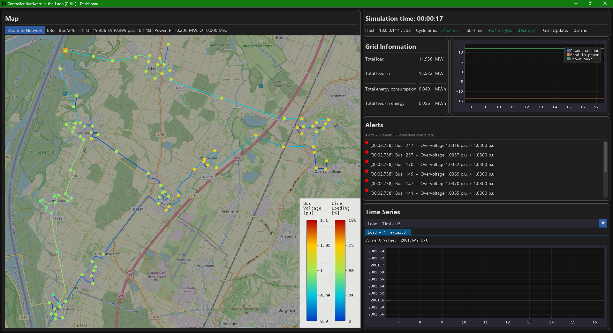
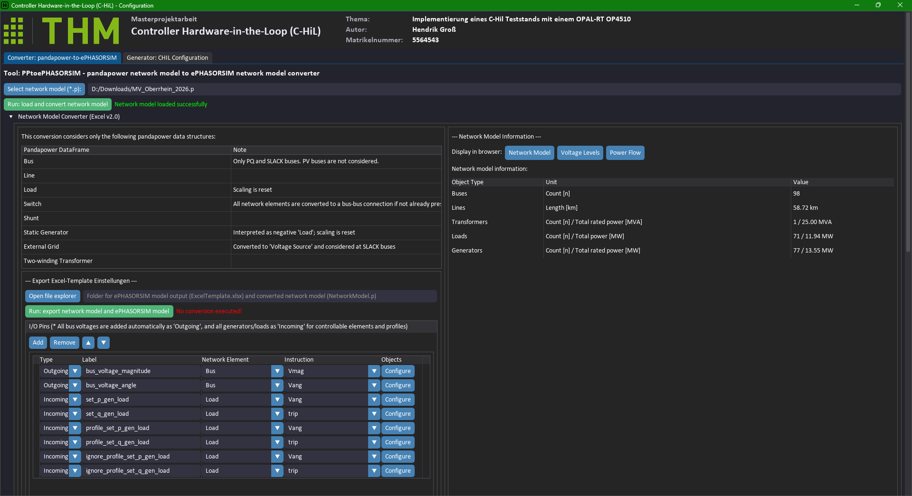

<p align="center">
  <br>
  
  <br>
</p>

[](https://www.python.org/)
[](https://www.pandapower.org/)

## Project Title

**Design and commissioning of a C-HiL test bench for optimization workflows in electrical distribution grids based on an OPAL-RT 4510 platform**

#### Dashboard


#### Configuration


## Short Description

This repository provides the software and configuration building blocks for a Controller-Hardware-in-the-Loop (C-HiL) test bench. Its core purpose is coupling a `pandapower` grid model with a real-time simulator (OPAL-RT / ePHASORSIM) via `Modbus-TCP`, including runtime visualization and analysis in an operator dashboard.

The codebase is organized into three functional areas:

- `CiL/`: Runtime, grid element models, dashboard, and visualization
- `CiL/configuration/`: Tools for setup generation and model conversion
- `examples/`: Example scripts for onboarding and test execution

**Detailed package documentation**: [CiL - Controller/Dashboard Visualization](CiL/README.md)

## Main Features

Main capabilities include management of Modbus-compatible grid elements such as bus, load, generator, switch, and transformer; bidirectional data synchronization between real-time simulation and `pandapower`; and a configuration-driven system mapping that shields users from low-level `Modbus-TCP` and `pandapower` communication details.

Additional functionality includes an operator dashboard with map view, event log, and alert processing, plus Excel-based Modbus mapping and a dedicated `pandapower` to ePHASORSIM converter (`PPtoePHASORSIM`).

## Project Structure

```text
.
|- README.md
|- requirements.txt
|- CiL/
|  |- Controller.py
|  |- Bus.py
|  |- Load.py
|  |- Generator.py
|  |- Switch.py
|  |- Transformer2W.py
|  |- dashboard/
|  |- map/
|  \- configuration/
|     |- PP2CHIL.py
|     |- GUI/
|     \- NetConverter/
|- examples/
|  |- TestSim.py
|  \- rtlab_io_import.py
\- Ressources/
```

## Installation

Python 3.13+ is required. Install dependencies from the repository root:

```bash
pip install -r requirements.txt
```

For active development of package `CiL`, an editable install in the subfolder is optional:

```bash
cd CiL
pip install -e .
```

## Quick Start

### 1. Create or load a configuration

Create C-HiL configuration files with tools under `CiL/configuration/`. The GUI entry point is `CiL/configuration/PP2CHIL.py`.

### 2. Run the example

`examples/TestSim.py` loads a `pandapower` model, reads Excel-based configuration, creates alerts, and starts the dashboard. Before execution, adjust script paths and OPAL-RT target IP.

### 3. Convert network models

The subproject `CiL/configuration/NetConverter/` contains converter `PPtoePHASORSIM` to export `pandapower` networks to ePHASORSIM Excel format.

## Component Overview

- `Controller`: Coordinates Modbus communication and distributes the grid model to components
- `IModbusElement` and concrete classes: Represent grid elements and their `Modbus`/`pandapower` states
- `Value`: Encapsulates `Modbus` and `pandapower` values with data types and scaling
- `dashboard`: Contains GUI, alerting, event processing, and map overlay
- `map`: Provides map and tile widgets for visualization

## Subprojects

- [PPtoePHASORSIM - pandapower to ePHASORSIM converter](CiL/configuration/NetConverter/README.md)
- CiL Modbus address configurator

## Notes

- Example scripts are intended as starting points and include project-specific paths and IP addresses.
- Detailed technical package documentation is available in [CiL/README.md](CiL/README.md).
